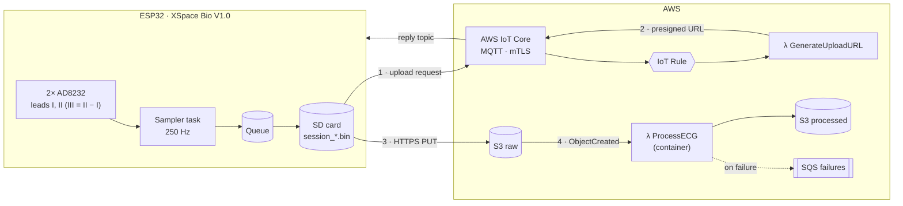
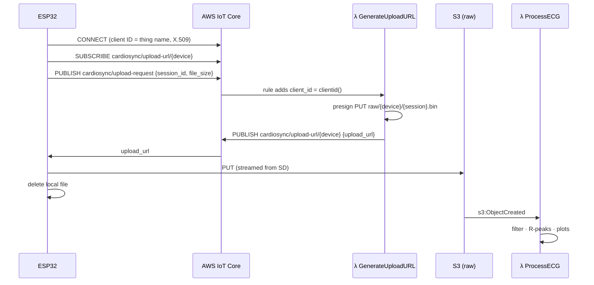

<div align="center">

# 🫀 CardioSync

**An ESP32 Holter monitor that records 3-lead ECG to an SD card and ships every session to AWS for filtering, heart-rate detection and reporting.**

[](https://github.com/LeonAchata/CardioSync/actions/workflows/ci.yml)


</div>

---

## ✨ Highlights

- **Jitter-free sampling** – a dedicated FreeRTOS task samples both AD8232 front-ends at 250 Hz with `vTaskDelayUntil`, decoupled from SD card writes through a queue.
- **Offline first** – sessions are written to the SD card in a compact binary format; files that fail to upload are retried automatically on the next cycle.
- **Secure device identity** – mutual-TLS MQTT to AWS IoT Core with one X.509 certificate per device and a least-privilege policy (a device can only act as itself).
- **Direct-to-S3 uploads** – the device gets a short-lived presigned URL over MQTT and streams the file from the SD card straight to S3 (no RAM limit on file size).
- **Serverless analysis** – every upload triggers a Lambda that filters the ECG (band-pass, 60 Hz notch, wavelet denoising), detects R-peaks and publishes plots, a CSV and a JSON summary.
- **One-command infrastructure** – Terraform provisions IoT things, certificates, buckets, Lambdas, ECR and a DLQ, and **generates the firmware's `aws_config.h`** for you.

## 🏗️ Architecture



<details>
<summary><b>Upload sequence</b></summary>



</details>

## 📁 Repository layout

```
CardioSync/
├── firmware/                     # PlatformIO project (ESP32, Arduino)
│   ├── include/
│   │   ├── config.h              # capture duration, sample rate, pins, timeouts
│   │   ├── ecg_format.h          # binary file format (shared contract with the cloud)
│   │   ├── aws_config.example.h  # IoT endpoint + certificates (generated by Terraform)
│   │   └── wifi_config.example.h # WiFi credentials
│   └── src/
│       ├── main.cpp              # system state machine: wait → capture → upload
│       ├── capture/              # AD8232 sampling task + SD writer
│       ├── upload/               # MQTT request + S3 presigned upload
│       ├── net/                  # WiFi + NTP
│       └── ui/                   # optional SSD1306 OLED status screen
├── cloud/
│   ├── lambdas/
│   │   ├── generate_upload_url/  # λ: presigned URL over MQTT
│   │   └── process_ecg/          # λ (container): signal processing + reports
│   │       └── cardiosync/       # parser, filters, HR detection, plots, local CLI
│   └── tests/                    # pytest suite with synthetic ECG
├── infra/terraform/              # all AWS infrastructure as code
└── .github/workflows/ci.yml      # firmware build, tests, lint, terraform validate
```

## 🔧 Hardware

| Component | Details |
|-----------|---------|
| Board | XSpace Bio V1.0 (ESP32-WROOM, 240 MHz, 4 MB flash) |
| ECG front-end | 2× AD8232 – lead I on GPIO34, lead II on GPIO35 (lead III is derived) |
| Storage | microSD over SPI – CS 5, MOSI 23, MISO 19, SCK 18 (FAT32) |
| Display *(optional)* | SSD1306 128×64 OLED over I²C (0x3C / 0x3D) |
| Connectivity | 2.4 GHz WiFi (on only while syncing the clock and uploading) |

> WiFi is powered down during every capture to reduce noise on the analog front-end and save power.

## 🚀 Getting started

### Prerequisites

- [PlatformIO](https://platformio.org/) (CLI or VS Code extension)
- [Terraform](https://developer.hashicorp.com/terraform/install) ≥ 1.5
- [Docker](https://docs.docker.com/get-docker/) running (builds the processing Lambda image)
- AWS credentials with permissions for IoT, S3, Lambda, ECR, IAM, SQS and CloudWatch Logs

### 1 · Deploy the cloud

```bash
cd infra/terraform
cp terraform.tfvars.example terraform.tfvars   # set region, device IDs...
terraform init
terraform apply
```

This creates everything in the diagram **and writes `firmware/include/aws_config.h`** with the IoT endpoint, the MQTT topics and the device certificate/key (one file per device is also written to `infra/terraform/generated/<device_id>/`).

> 🪟 **Windows + Docker Desktop:** set `docker_host = "npipe:////./pipe/docker_engine"` in `terraform.tfvars`.

### 2 · Configure WiFi

```bash
cd firmware/include
cp wifi_config.example.h wifi_config.h   # then edit SSID and password
```

### 3 · Build and flash

```bash
cd firmware
pio run -e esp32dev -t upload        # headless build
pio run -e esp32dev-display -t upload  # with the OLED status screen
pio device monitor
```

### 4 · Check the results

A few seconds after each upload the processed session appears in the processed bucket:

```
s3://<processed-bucket>/processed/<device_id>/<session_id>/
├── metadata.json        # duration, sample rate, BPM per lead, R-peak indices
├── signals.csv          # raw + filtered mV for leads I, II, III
├── ecg_filtered.png     # 3 leads with detected R-peaks
└── ecg_comparison.png   # lead II raw vs filtered
```

```bash
aws s3 ls s3://$(terraform -chdir=infra/terraform output -raw processed_bucket)/processed/ --recursive
```

## ⚙️ How the device works

```
 boot ─► mount SD ─► WiFi + NTP (then WiFi off) ─┐
                                                 ▼
        ┌──────────── wait PAUSE_BETWEEN_SESSIONS_SEC ◄──────────┐
        ▼                                                         │
   CAPTURE 15 s @ 250 Hz ─► UPLOAD current file + SD backlog ─────┘
        │                          (failures stay on the SD card)
        └─► unrecoverable error (no SD) ─► reboot after 30 s
```

- Session files are named `session_<unix_time>.bin`; if NTP is unavailable a boot counter stored in NVS keeps names unique (`session_boot<N>.bin`).
- The capture header is patched with the final sample count when the file is closed; the cloud parser also recovers files whose header was never patched (e.g. power loss).
- All tunables live in [`firmware/include/config.h`](firmware/include/config.h):

| Setting | Default | Description |
|---------|---------|-------------|
| `CAPTURE_DURATION_SEC` | `15` | Length of each session |
| `ECG_SAMPLE_RATE_HZ` | `250` | Sampling rate (must divide 1000) |
| `PAUSE_BETWEEN_SESSIONS_SEC` | `10` | Idle time between cycles |
| `MAX_UPLOADS_PER_CYCLE` | `5` | Current file + backlog uploaded per cycle |
| `UPLOAD_URL_TIMEOUT_MS` | `60000` | Wait for the presigned URL |
| `TZ_INFO` | `<-05>5` | POSIX time zone used in logs |

## 📊 Session file format

Little-endian binary, defined once in [`firmware/include/ecg_format.h`](firmware/include/ecg_format.h) and parsed by [`cloud/lambdas/process_ecg/cardiosync/parser.py`](cloud/lambdas/process_ecg/cardiosync/parser.py).

| Offset | Field | Type | Notes |
|-------:|-------|------|-------|
| 0 | `magic` | `uint32` | `0x45434744` (`"ECGD"`) |
| 4 | `version` | `uint16` | `1` |
| 6 | `device_id` | `uint16` | |
| 8 | `session_id` | `uint32` | Unix time or boot counter |
| 12 | `timestamp_start` | `uint32` | Unix time, `0` if the clock was not synced |
| 16 | `ecg_sample_rate` | `uint16` | Hz |
| 18 | `imu_sample_rate` | `uint16` | Hz (`0`: no IMU) |
| 20 | `num_ecg_samples` | `uint32` | |
| 24 | `num_imu_samples` | `uint32` | |
| 28 | ECG samples | `3 × int16` | leads I, II, III · `mV = value / 6553.6` (±5 mV) |

15 s at 250 Hz → 3 750 samples → **22.5 KB** per session.

## 🧪 Signal processing

For every lead the `ProcessECG` Lambda runs:

1. **High-pass 0.5 Hz** (4th-order Butterworth, zero-phase) – removes baseline wander.
2. **Low-pass ≤ 100 Hz** – removes high-frequency noise.
3. **Notch 60 Hz** (Q = 30) – removes mains interference.
4. **Wavelet denoising** (db4, soft VisuShrink threshold), more aggressive on motion segments when accelerometer data is present.
5. **R-peak detection** – peaks above 3σ with a 300 ms refractory period (≤ 200 BPM), polarity-agnostic; BPM from the mean R-R interval.

### Analyse a file locally

Pull a `.bin` off the SD card and run the exact same pipeline on your machine:

```bash
cd cloud
pip install -r requirements-dev.txt
PYTHONPATH=lambdas/process_ecg python -m cardiosync /path/to/session_1727712000.bin -o out/
# 15.0 s | 72.0 BPM avg | lead II: 16 beats
```

### Tests

```bash
cd cloud
pytest -q          # parser, HR detection on synthetic ECG (55/72/110 BPM), both Lambdas
ruff check .
```

## ☁️ Infrastructure

Everything is defined in [`infra/terraform`](infra/terraform):

| Resource | Purpose |
|----------|---------|
| `aws_iot_thing` + `aws_iot_certificate` | One identity per device in `device_ids` |
| `aws_iot_policy` | Connect only as own thing, publish requests, receive own replies |
| `aws_iot_topic_rule` | `cardiosync/upload-request` → GenerateUploadURL (errors → CloudWatch) |
| `aws_lambda_function` ×2 | GenerateUploadURL (zip, arm64) and ProcessECG (container image) |
| `aws_ecr_repository` | ProcessECG image, rebuilt only when its sources change |
| `aws_s3_bucket` ×2 | `raw` and `processed` — private, encrypted, TLS-only |
| `aws_sqs_queue` | Failure destination for sessions that could not be processed |

Useful outputs: `terraform output iot_endpoint`, `raw_bucket`, `processed_bucket`, `lambda_functions`, `process_failures_queue_url`.

> 🔐 **The Terraform state contains the device private keys.** Keep it local or use an encrypted remote backend (e.g. S3 with SSE and restricted access). Generated `aws_config.h` files are git-ignored.

Tear everything down with `terraform destroy` (set `force_destroy = true` first if the buckets contain data).

## 🔍 Troubleshooting

| Symptom (serial log) | Likely cause |
|----------------------|--------------|
| `[ERROR] SD card not available` | Card missing, not FAT32, or wiring. The device reboots every 30 s. |
| `MQTT connection failed (state ...)` | Wrong endpoint, inactive certificate, or `DEVICE_ID` different from the IoT thing name (the policy only accepts the thing name as client ID). |
| `Timeout waiting for upload URL` | Check `/aws/lambda/<name>-generate-upload-url` and `/aws/iot/<name>/rule-errors` logs. |
| `S3 upload failed: HTTP 403` | URL expired or `Content-Type` mismatch. |
| `Clock not synced` | No NTP; files fall back to `session_boot<N>` names. |
| Nothing in the processed bucket | Check the ProcessECG logs and the failures SQS queue. |

Subscribe to `cardiosync/#` in the **AWS IoT → MQTT test client** to watch the exchange live.

## 🗺️ Roadmap

- [ ] Lead-off detection using the AD8232 LO pins
- [ ] Deep sleep between sessions
- [ ] OTA firmware updates through AWS IoT Jobs
- [ ] HRV metrics and arrhythmia flags
- [ ] Web dashboard for processed sessions

## 👤 Author

**Leon Achata** · developed for the Instrumentation course at PUCP.

<sub>⚠️ Educational project — not a certified medical device and not intended for diagnosis.</sub>
